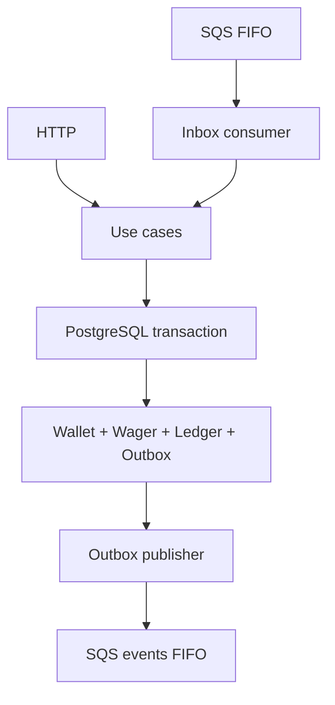

# Arquitetura e decisões

## Visão geral

O serviço usa DDD pragmático e arquitetura em camadas. `wallet` mantém o aggregate e o ledger; `wagering` contém o ciclo das operações; `messaging` implementa Inbox, Outbox e adaptadores SQS. Domínio não importa NestJS, MikroORM nem AWS. Aplicação depende de portas de repositório, publicação e `UnitOfWork`; infraestrutura fornece os adaptadores.

## Dinheiro e persistência

`Money` é um value object imutável sobre `decimal.js`. A entrada aceita somente decimal não científico com até duas casas; a saída sempre usa duas casas. Moeda é ISO-4217 em três letras maiúsculas. Valores monetários atravessam contratos como strings e são persistidos em `numeric(20,2)` com moeda separada. `number` aparece apenas em dados não monetários, como versão, tentativas, limite, duração e métricas.

O MikroORM foi escolhido pela fronteira explícita de `EntityManager.transactional()` e suporte a locks. Entidades do ORM não contaminam o domínio; mappers chamam factories `rehydrate`, que restauram estado persistido sem repetir transições.

## Transação e invariantes

Uma operação financeira confirma de forma atômica:

- criação/estado da `WagerTransaction`;
- atualização condicionada da Wallet;
- lançamento imutável no ledger, quando há movimento;
- registro da Inbox, na entrada SQS;
- eventos pendentes no Outbox.

Nada é publicado no broker antes do commit. Constraints PostgreSQL reforçam saldo não negativo, moeda, pares de campos, unicidade `(playerId, currency)`, idempotência por provider e chave, um lançamento por transação/wallet e uma reversão processada por referência/tipo. Uma foreign key liga a referência interna e um trigger rejeita `UPDATE`/`DELETE` no ledger. Migrations são versionadas e possuem `down`.

## Concorrência

A unidade de disputa é `walletId`; não existe lock global. A Wallet usa **optimistic locking**: inicia em versão 1 e incrementa somente quando o saldo muda. O update usa `WHERE id = ? AND version = ?`; zero linhas significa conflito otimista. O caso de uso reinicia a transação com estado fresco até 5 vezes. Depois disso reporta falha transitória. Não usamos `SELECT ... FOR UPDATE` nem lock pessimista para proteger saldo da Wallet.

Isso preserva paralelismo entre wallets e resolve a hot wallet sem lost update. No cenário de duas apostas de `80.00` contra `100.00`, uma confirma; a outra reabre o estado com saldo `20.00` e é rejeitada sem ledger. Constraints únicas resolvem também corridas de idempotência e reversão; o perdedor consulta e devolve o resultado persistido.

SQS FIFO usa a wallet/aggregate como `MessageGroupId`. Isso reduz reordenação, mas não é fonte de correção: entradas HTTP, redelivery, múltiplos consumidores e referências fora de ordem continuam seguras pelo banco.

`FOR UPDATE SKIP LOCKED` é reservado aos fluxos de **claim de trabalho**: Outbox e referências pendentes. Nesses casos ele permite que workers diferentes reivindiquem linhas distintas sem bloquear uns aos outros; ele não participa da proteção do saldo da Wallet.

## Execução distribuída local

A imagem da aplicação é multi-stage (`deps`, `build`, `runtime`). O estágio final contém o `dist`, Bun e apenas dependências de produção. Migrations são executadas pelo artefato compilado em um container one-shot antes das réplicas da aplicação.

No Compose, PostgreSQL e LocalStack são serviços compartilhados. O profile `app` sobe três réplicas do mesmo serviço `app`; cada réplica contém API e workers e possui processo, heap e pool de conexões próprios. Um nginx exposto em `:3000` faz round-robin sobre o DNS interno `app`. Escalar para mais réplicas não altera a estratégia de correção, pois optimistic locking, Inbox, Outbox e constraints residem no PostgreSQL, e a fila é compartilhada.

## Idempotência e replay

O header HTTP `Idempotency-Key` é a fonte da verdade. Para SQS ele está dentro de `data`; `messageId` pertence à Inbox e não substitui a chave da operação. O payload de negócio é serializado por uma função canônica recursiva que ordena chaves e então recebe SHA-256. Headers e metadados do envelope não participam.

Há duas identidades persistentes:

- `(providerId, idempotencyKey)` detecta repetição e conflito de payload;
- `(providerId, externalTransactionId)` permite referência e consulta do provedor.

Replay idêntico retorna status, `transactionId`, `failureCode` e `resultingBalance` persistidos. Por isso ele não observa o saldo atual da Wallet.

## Referências fora de ordem

`REFUND` e `ROLLBACK` sem referência são persistidos como `PENDING_REFERENCE`; isso é um estado auditável, não erro transitório do transporte. Um worker reivindica registros vencidos em transação curta com `FOR UPDATE SKIP LOCKED` e lease persistente, depois reprocessa fora do claim.

O backoff é exponencial com limite operacional, e o máximo é 8 tentativas. Quando esgota, a operação torna-se `REJECTED` com `REFERENCE_NOT_FOUND`. Se o processo morrer, o lease expira e outra instância assume. A política privilegia recuperação rápida no desafio; em produção, tempos e TTL seriam ajustados à janela máxima de atraso acordada com provedores.

## Inbox, Outbox e falhas

### Entrada

O consumidor valida o envelope, registra Inbox e chama o mesmo use case do HTTP. Ack acontece depois do commit. Regra de negócio terminal recebe ack; indisponibilidade e conflito esgotado causam redelivery; payload permanentemente inválido avança até a DLQ. Em `SIGTERM`, os hooks do Nest interrompem novos polls e aguardam o processamento em andamento antes de encerrar.

### Saída

Publishers concorrentes fazem claim em transação curta, gravando `lock_id` e `locked_until`. A chamada de rede nunca mantém uma transação SQL aberta. Confirmação marca `published_at` somente se o worker ainda possui o lease; falha incrementa tentativas e agenda o próximo envio.

O contrato é **at-least-once**. Os principais crash windows são:

- commit antes da publicação: o Outbox preserva o evento e outro publisher assume;
- SQS aceitou antes de `published_at`: pode haver duplicata, mas `eventId`/`MessageDeduplicationId` são estáveis e o consumidor deve usar Inbox;
- claim antes da publicação: lease expirado recupera a mensagem.

Não há caminho que publique um evento ainda não confirmado financeiramente.

## Reconciliação

A reconciliação soma o ledger completo a partir de zero e compara com o saldo materializado usando `Money`. Divergência não altera dados: retorna `consistent: false`, registra log estruturado e incrementa métrica. Isso evita esconder corrupção e mantém correção como ação operacional explícita.

## Observabilidade

Logs são JSON e incluem os identificadores disponíveis (`correlationId`, `messageId`, `transactionId`, `walletId`, `providerId`), sem payload financeiro integral. As métricas cobrem status, duplicatas, retry, DLQ, conflitos de concorrência, lag do Outbox, latência e reconciliação. Liveness verifica o processo; readiness consulta PostgreSQL e resolve as filas SQS.

As métricas são mantidas em memória por instância e reiniciam com o processo. Elas servem exposição Prometheus para o exercício, não garantia funcional. Em produção seriam agregadas por um collector/OpenTelemetry e backend durável.

## Autenticação

O enunciado não pontua autenticação e permite documentar a ausência. Para preservar o foco financeiro, foi criado um `NoopAuthGuard` aplicado às APIs de negócio, com uma porta de identidade do provedor como ponto de extensão. Health permanece aberto e SQS é canal interno confiável.

Em produção, o guard seria substituído por OIDC com Keycloak/Zitadel. O token de cliente identificaria o provider; a aplicação compararia essa identidade com `providerId`, aplicaria scopes por endpoint e propagaria o subject como contexto de auditoria. Não haveria tabela local de senha.

## Limitações conscientes

- Não há ledger de partidas dobradas; não é requisito obrigatório.
- Métricas não sobrevivem a restart e não são agregadas entre processos.
- O endpoint de ledger usa cursor opaco e ordenação estável, mas a consulta poderia ser otimizada para seek pagination diretamente no SQL em volumes altos.
- A suíte mantém um teste de múltiplos contextos Nest no mesmo processo como cobertura de integração, mas a prova dedicada de concorrência agora sobe três processos Bun/Nest independentes, com heaps, runtimes e pools ORM separados, compartilhando somente PostgreSQL/LocalStack.
- Não há OpenTelemetry nem dashboard, ambos opcionais.

## Estratégia de testes

Testes unitários usam o runner nativo do Bun. Integração/E2E usa PostgreSQL e LocalStack reais do Compose, sem substituir as garantias distribuídas por mocks. A suíte cobre constraints e migrations, rollback atômico, Inbox/redelivery/DLQ, Outbox com publishers concorrentes e lease, 50 duplicatas simultâneas, disputa de saldo, wallets paralelas, referência anterior à origem e reconciliação final. `bun run test:concurrency` complementa essa suíte com três processos do sistema operacional: duas instâncias disputam `80.00` sobre a mesma Wallet de `100.00`, enquanto a terceira consulta/reconcilia o estado compartilhado; outro cenário prova paralelismo entre wallets distintas.
